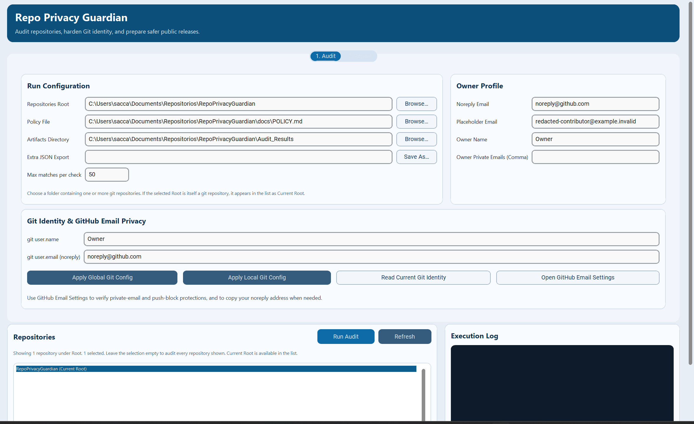
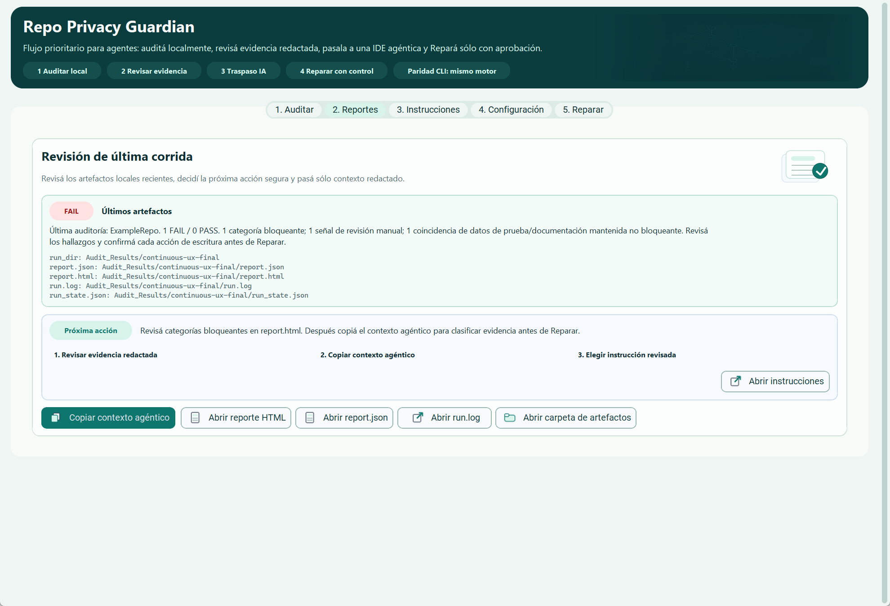
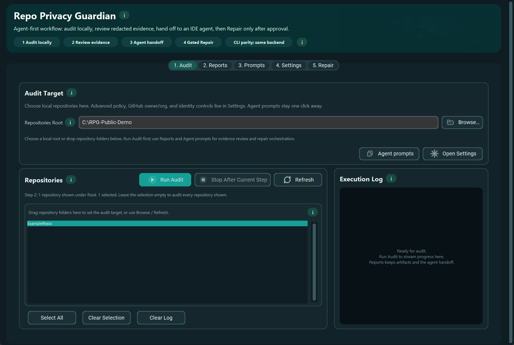
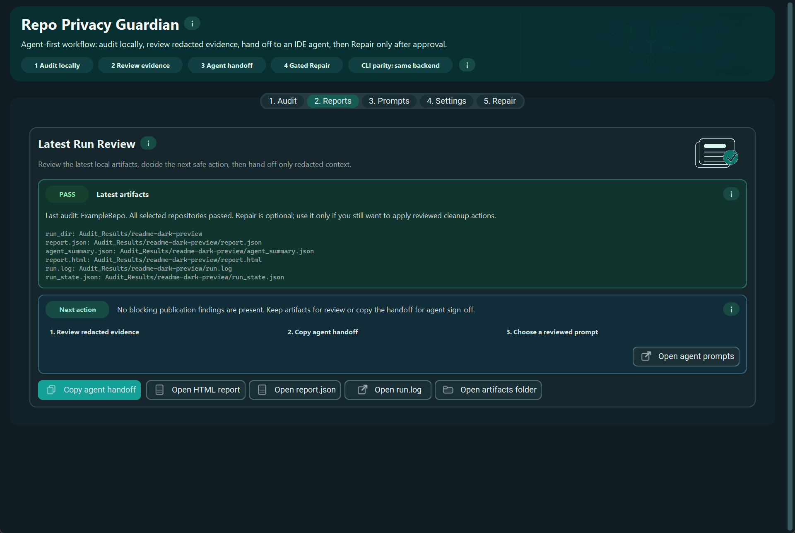

# Repo Privacy Guardian


🔒 Repo Privacy Guardian is an agent-first, local-first publication gate for auditing and hardening Git repositories before public release.

Its value comes from combining deterministic local checks with human or AI-assisted review: the tool creates redacted evidence, an operator or coding agent classifies what matters, and only reviewed fixes are applied. It is built for coding-agent workflows in Codex, Claude Code, Antigravity, GitHub Copilot, Cursor, and similar IDEs. The optional desktop GUI is a companion for manual review, reports, prompts, and gated repair on the same underlying pipeline. Developed and maintained by **Okavango SAS**.

## Public Repository Operating Contract

This repository itself is already public. Any pushed branch, commit, tag, PR, issue reference, screenshot, or documentation edit can become visible on the internet immediately, even though the tool is often used to prepare other target repositories before publication.

When working on Repo Privacy Guardian:

- review `git status --short` and `git diff --check` before staging or committing
- commit only intentional source, test, documentation, and sanitized asset changes
- keep local audit evidence, generated screenshots, release builds, coverage output, scratch prompts, and logs in ignored paths such as `Audit_Results/`, `.local-meta/`, `.coverage*`, `dist/`, `build/`, `*.egg-info/`, and `*-pre-publication-fix-*.bundle`
- never commit raw secrets, private emails, internal hostnames, private URLs, personal absolute paths, tokens in command examples, unredacted logs, or screenshots that reveal private local context
- use obvious placeholders and `.env.example` for non-secret variable names; do not put credentials in Git remotes, docs, tests, examples, CI config, or command arguments

If sensitive data reaches a commit, stop normal work, keep only redacted evidence, rotate the affected credential outside this repo, and coordinate a reviewed history cleanup before pushing further changes.

## 🔍 What It Audits

- leaked Git identity metadata, while treating known SSH remote pseudo-users such as `git@github.com`, `git@gitlab.com`, and `git@bitbucket.org` as transport syntax instead of email evidence
- secrets in tracked content, history, and Git metadata, including high-confidence provider tokens, webhooks, auth headers, and credentialed URLs
- low-confidence generic secret assignments as advisory review items, with synthetic fixtures and safe documentation examples separated from blocking findings
- personal or local absolute paths
- sensitive filenames in history
- tracked-but-ignored files and `.gitignore` drift
- advisory outbound or exfil-capable code indicators
- optional GitHub repository hardening posture for public GitHub remotes
- LiteLLM March 2026 supply-chain indicators

## 🌎 Language / Idioma

**Español (Latinoamérica).** Repo Privacy Guardian te ayuda a revisar repositorios Git antes de publicarlos: detecta secretos, metadatos de identidad Git, rutas personales, archivos sensibles e inconsistencias de `.gitignore`, y genera evidencia local en JSON, HTML y log. Está pensado para flujos con IDEs agénticas: primero auditoría local por CLI, después evidencia, clasificación y reparación revisada. La CLI se mantiene en inglés para preservar compatibilidad con automatizaciones, pero la GUI permite elegir `Español (Latinoamérica)` sin cambiar el comportamiento ni los reportes.

Para abrir la GUI en español desde este checkout:

```sh
python -m pip install ".[gui]"
repo-privacy-guardian --gui
```

Luego abrí `Settings` (`Configuración`) → `GUI Language` (`Idioma de la GUI`) → `Español (Latinoamérica)`.

**English.** Repo Privacy Guardian audits Git repositories before public release: it detects secrets, Git identity metadata, personal paths, sensitive files, and `.gitignore` drift, then writes local JSON, HTML, and log evidence. It is optimized for agentic IDE workflows: local CLI audit first, then evidence, classification, and reviewed repair. The CLI remains English for automation compatibility, while the GUI can switch between `English` and `Español (Latinoamérica)` without changing behavior or reports.

## 🧠 Agent-First Mental Model

Repo Privacy Guardian is not meant to replace a release engineer or coding agent. It gives them a safer operating loop:

| Layer | Role | Output |
| --- | --- | --- |
| Local scanner | Runs deterministic Git, file, policy, and hardening checks without uploading repository contents | `agent_summary.json`, `report.json`, `report.html`, `run.log`, and `run_state.json` |
| Operator or coding agent | Classifies redacted evidence as confirmed leak, intentional fixture/example, indeterminate/manual-review, advisory hardening, or tooling/runtime issue | A reviewed decision and a small remediation plan |
| Repair gate | Applies only approved mechanical fixes, with dry-run preview and owner/push guardrails | A changed checkout that must be re-audited until `PASS` |

Use the CLI for repeatable automation and agentic IDE work. Use the GUI when a human wants a desktop companion for target selection, local evidence review, maintained prompts, Settings, and visually gated repair. The GUI should make the workflow more understandable; it should not introduce a separate policy engine, hidden network service, or web-app-only path.

## 🖥️ Desktop GUI Preview

| Mode | Audit | Reports and agent handoff |
| --- | --- | --- |
| Light |  |  |
| Dark |  |  |

The desktop GUI is optional and shares the same audit engine, policy keys, report schema, and safety gates as the CLI. It is a companion for manual review: `Audit` starts the local run, `Reports` opens local evidence, shows the next safe action, and can copy a privacy-safe agent handoff, `Prompts` exposes the maintained staged prompt library, and `Repair` stays gated.

The screenshots above intentionally show the same companion workflow across light and dark desktop themes. Maintained, sanitized GUI screenshots live under `docs/ux-audit/`; visible paths and repository names use neutral examples so private local context is not published in image pixels.

## ⚡ 60-Second First Run

Use this when you cloned the repository and want a coding agent to check whether another repo is safe to publish. The agent still runs the CLI locally; the human keeps control over fixes, history rewrites, and pushes.

Typical first run for a coding agent/operator pair:

1. install the base CLI
2. run the first audit without writes
3. inspect `Audit_Results/<run_id>/report.html`
4. approve fixes only after findings are classified

One-time setup in the agent environment:

```sh
python -m pip install .
```

Then paste this into Codex, Claude Code, Antigravity, GitHub Copilot, Cursor, or a similar coding agent:

```text
Act as a release/security engineer. Work only on <target-repo>.
Use Repo Privacy Guardian from CLI, not GUI.
Start with repo-privacy-guardian --help, then run repo-privacy-guardian --check-tooling.
Run the first audit without writes:
repo-privacy-guardian --root <repos-root> --repos <target-repo> --dry-run --yes
Read Audit_Results/<run_id>/agent_summary.json, report.json, report.html, and run.log.
Classify findings as confirmed leak, intentional fixture/example, indeterminate/manual-review, advisory hardening, or tooling/runtime issue.
Report risk, possible consequence, and one next action per finding group.
Do not apply fixes, rewrite history, push, or paste raw secrets/private paths/unredacted logs unless I explicitly approve.
```

If you are running without an agent, execute the same first commands manually:

| Goal | Command |
| --- | --- |
| Check local prerequisites | `repo-privacy-guardian --check-tooling` |
| Audit one repo without writing changes | `repo-privacy-guardian --root /path/to/repos --repos MyRepo --dry-run --yes` |
| Open the desktop GUI for manual review | `python -m pip install ".[gui]"` then `repo-privacy-guardian --gui` |

How to read the first result:

- `PASS`: no blocking publication issue was found.
- `REVIEW`: the repo may still be publishable, but inspect advisory findings first.
- `FAIL`: do not publish yet; fix the blocking findings and re-run the audit.

All run evidence stays local under `Audit_Results/<run_id>/` as `agent_summary.json`, `report.json`, `report.html`, and `run.log`.

## 🧭 Start Here

Pick the shortest path for your role. Most users only need the first two rows; the rest of the README is reference material.

| Need | Start with | Outcome |
| --- | --- | --- |
| Audit another repo fast, especially through an agentic IDE | `60-Second First Run` above | Local dry-run artifacts under `Audit_Results/<run_id>/` |
| Run manually from a terminal | `Installation`, then `Command Reference` | Repeatable CLI audit with explicit report paths |
| Use the desktop companion | `Desktop GUI Preview`, then `GUI Contract` | Same audit engine with visual review and prompts |
| Work on this repository | [LOCAL_DEVELOPMENT](docs/LOCAL_DEVELOPMENT.md) | Dev setup, validation loops, and repo map |
| Maintain this project | [OPERATIONS](docs/OPERATIONS.md), [RELEASE_CHECKLIST](docs/RELEASE_CHECKLIST.md), then `python scripts/release_readiness.py` | Validation gates and recovery notes |

## 🧱 Support Matrix

- Linux CLI: supported; automatic CI smoke runs on Ubuntu with Python `3.13`
- Windows CLI: supported target; validate through the manual extended CI suite plus local release validation before changing support claims
- macOS CLI: supported target; validate through local/manual release validation before changing support claims
- Windows GUI: supported; manual extended CI smoke runs on `windows-latest` with Python `3.11`
- Linux GUI desktop: best-effort and depends on Tk availability plus a graphical session
- macOS GUI: best-effort / not a release priority
- Headless and CI environments: CLI only

## ✅ Product Contract

Blocking checks that can change `PASS` to `FAIL`:

- dirty working tree
- Git fsck failures
- private or unexpected commit metadata emails or malformed non-email identity tokens
- tracked, historical, or Git metadata high-confidence secret indicators
- tracked or historical personal path leaks
- low-confidence email findings when configured as blocking
- sensitive filenames in history
- tracked-but-ignored files
- missing required `.gitignore` rules
- LiteLLM `HIGH` or `CRITICAL` incident evidence
- remediation execution errors during `--fix`

Advisory checks that do not change `PASS` or `FAIL` by default:

- `exfil_code_indicators`
- `tracked_secret_low_confidence`, `history_secret_low_confidence`, and `git_metadata_secret_low_confidence`
- `tracked_secret_fixture_matches`, `history_secret_fixture_matches`, `tracked_secret_documentation_matches`, and `history_secret_documentation_matches`
- `tracked_email_fixture_matches` and `history_email_fixture_matches`
- `reviewed_network_indicators`
- `github_hardening_findings`
- `github_hardening_warnings`

`exfil_code_indicators` is intentionally manual-review only by default. It is surfaced in CLI guidance, JSON, HTML, and severity highlights, but it does not fail a repository unless a future strict mode is introduced.

`reviewed_network_indicators` preserves known-intent network calls that belong to Repo Privacy Guardian itself, such as read-only GitHub API probes and the optional Windows App Installer bootstrap command. Those entries stay visible in JSON, HTML, logs, GUI safe-context counts, and agent summaries, but they do not require manual exfil review. The classifier only applies when the audited checkout is recognized as this project and the line matches a narrow reviewed pattern; lookalike paths in other repositories still remain `exfil_code_indicators`.

Generic `password = ...`, `api_key = ...`, `client_secret = ...`, and similar assignments are separated as low-confidence advisory findings unless they also match a high-confidence provider pattern. Placeholder-looking values in tests, fixtures, docs, examples, and README-style files are surfaced separately as safe fixture/documentation evidence instead of blocking publication. Email addresses in tracked or historical test/fixture contexts are also preserved in safe fixture buckets, while README/docs contact examples that look real remain low-confidence review items.

GitHub hardening findings and warnings are also advisory/manual-review only by default when `--audit-github-hardening` is enabled. Passing `--strict-profile release` promotes GitHub hardening findings to blocking only when `--audit-github-hardening` was explicitly enabled; it does not enable network checks by itself.

`--strict-profile` provides documented policy presets without changing defaults when the flag is omitted:

- `audit-only`: rejects `--fix` and `--push`
- `internal`: explicit current-default posture
- `release`: treats low-confidence emails as blocking and treats opt-in GitHub hardening findings as blocking

`--suppressions PATH` accepts a versioned JSON file for advisory/manual-review suppressions. Suppressions require `schema_version`, `id`, `category`, `pattern`, `reason`, `owner`, and `expires`, leave redacted `suppressed_findings` traceability in reports, and cannot suppress high-confidence secrets, path leaks, dirty trees, fsck failures, Git metadata blocking findings, execution errors, or fix errors.

## 🌐 Network Behavior

- Default audits, fix planning, and report generation operate on local Git metadata, local tracked files, and local history.
- `--public-only` performs a read-only unauthenticated GitHub REST API request for GitHub remotes to decide whether a repository is publicly accessible.
- `--audit-github-hardening` performs read-only GitHub REST API requests against GitHub remotes to inspect repository settings. Admin-only checks require `REPO_PRIVACY_GUARDIAN_GITHUB_TOKEN`, `GITHUB_TOKEN`, or `GH_TOKEN`.
- `--github-owner` is an opt-in remote audit mode. It uses the GitHub REST API to discover repositories for a user/org, clones matches into a temporary private directory, audits those clones with the normal pipeline, and removes the clones after the run.
- Remote GitHub auditing is audit-only: it cannot be combined with `--fix` or `--push`. Public repositories are cloned with `git`; private repositories require an authenticated GitHub CLI session for `gh repo clone` so tokens are not placed in Git remote URLs or process arguments.
- The default CLI/GUI paths do not upload repository contents, reports, or telemetry to a remote service.

## 🔒 Local Security Posture

- Run artifacts are kept local and are written with private file permissions where the platform supports them.
- Each run writes a local `run_state.json` manifest with phase timings and per-repository timing snapshots so a partial, cancelled, or interrupted execution still leaves phase/exit diagnostics behind.
- Generated rewrite inputs such as temporary `mailmap` and `replace-text` files are removed after use instead of being left behind in temp storage.
- Tracked-file scanners skip symlinked files and oversized text candidates to reduce accidental local file disclosure and unbounded memory reads.
- Local auto-discovery skips symlinked child directories. Audit symlinked checkouts only by explicit operator-selected target so the scanned set stays predictable.
- Report/export writes, report-directory creation, and `.gitignore` remediation refuse symlinked target paths instead of following them.
- Temporary clone cleanup refuses symlinked path components before recursive removal.
- Repository execution is serialized with an OS-backed lock file in the Git metadata directory so overlapping audits/fixes do not mutate the same checkout concurrently, and crashed owners do not need PID/timestamp stale-lock reclamation.
- GitHub owner/org discovery and clone work are bounded: `gh auth token` probes use a short non-interactive timeout, paginated repository discovery fails closed at the page limit, and clone parallelism is capped.

## 🧰 Tooling Readiness

- `--check-tooling` verifies the local tools needed for the selected mode before you start a run.
- `--install-missing-tools` attempts to install supported missing tools automatically.
- The current readiness flow checks Git, GUI dependencies, rewrite tooling, Windows App Installer / `winget`, and GitHub hardening auth helpers when those features are relevant.
- In `--gui` mode, when the desktop preflight detects supported missing prerequisites, the app offers a popup to install them and retry startup automatically.
- In the GUI, enabling GitHub hardening also offers optional installation/repair of `gh`, and on Windows it can bootstrap App Installer / `winget` from the official Microsoft bundle when possible.
- For GitHub hardening token-gated checks, the supported helpers are token environment variables or an authenticated GitHub CLI (`gh auth login`).
- GitHub MCP is not a prerequisite for the standalone CLI/Desktop tool and is not required for end-user installations.
- `.env.example` is tracked as a reference for optional GitHub auth variables, but the tool does not auto-load it.

## 🖥️ CLI-First Behavior

- Running the program without flags shows CLI help and exits successfully.
- Use `--gui` for the desktop interface.
- CLI does not open a browser automatically.
- Use `--open-report` only when you explicitly want the HTML report opened after a CLI run.
- Use `--agent-summary` when you want the CLI to print a privacy-safe handoff summary for a coding agent; `agent_summary.json` is written for every run even without the flag.
- GUI runs can be cancelled; cancellation stops after the active repository step completes and the run is recorded as `ABORTED`.
- In the GUI, `Open HTML report automatically` is opt-in and off by default.
- The GUI keeps the staged `Audit -> Repair` interaction so operators cannot jump straight to write actions.
- The GUI stores non-secret setup preferences locally after setup, then collapses policy/output/GitHub/identity controls into Settings so the main screen stays focused on repository selection, Audit, and the log.
- The GUI repository list accepts drag-and-drop of local repository folders when the optional desktop drag-and-drop runtime is available; the Browse/Refresh path remains the fallback.
- `--check-tooling --gui` reports drag-and-drop readiness as an optional warning, not as a GUI startup blocker.
- GUI and CLI expose the same audit inputs for local repositories, GitHub owner/org remote audits, GitHub hardening, LiteLLM incident checks, report outputs, low-confidence email mode, and repair-only write options. GitHub owner/org remote audit remains audit-only in both paths.
- The GUI language selector supports English and Spanish (Latin America). Locale affects GUI labels, dialogs, and contextual help only; CLI flags, run settings, reports, and backend behavior stay unchanged.
- The GUI theme selector supports System, Light, and Dark. System is the default and follows OS theme changes automatically. Theme is presentation-only and does not change CLI flags, run settings, report fields, or policy behavior.
- The tracked `DESIGN.md` defines the desktop visual tokens and UX constraints used for GUI changes.
- `DESIGN.md` follows the public Google Labs `google-labs-code/design.md` format pinned to release `0.1.0`; optional upstream validation must use pinned tooling such as `npx --yes @google/design.md@0.1.0 lint DESIGN.md`, a sanitized environment with no GitHub/npm secrets, and read-only least-privilege execution.

## 📦 Installation

For most users, the base CLI install is enough. Add GUI, remediation, test, or dev extras only when you need those surfaces.

Recommended verified path for a cloned checkout:

```sh
python -m pip install .
```

Verified path from a locally built artifact:

```sh
python -m build
python -m pip install dist/<wheel-file.whl>
```

If you reuse the same workspace for multiple builds, clear old `dist/`, `build/`, and `*.egg-info/` outputs before relying on a fresh local package artifact.

Base CLI plus tests:

```sh
python -m pip install ".[test]"
```

Optional GUI support:

```sh
python -m pip install ".[gui]"
```

Optional remediation extras for history rewrite workflows:

```sh
python -m pip install ".[remediation]"
```

Developer environment:

```sh
python -m pip install ".[dev]"
```

Optional environment reference:

- `.env.example`: tracked reference for optional GitHub auth variables used by `--audit-github-hardening`

Compatibility requirement files:

- `config/requirements/requirements.txt`: base CLI has no extra Python runtime dependencies
- `config/requirements/requirements-gui.txt`: optional GUI dependency set
- `config/requirements/requirements-remediation.txt`: optional remediation dependency set
- `config/requirements/requirements-dev.txt`: local development and test dependencies

External requirements:

- Git must be installed and available on `PATH`
- `git-filter-repo` is required only for remediation that rewrites history
- GitHub CLI (`gh`) is optional for local audits, can supply admin auth for `--audit-github-hardening`, and is required for cloning private repositories in `--github-owner` mode
- Linux desktop GUI use may require a Tk package such as `python3-tk`
- DPI-aware GUI image assets use Pillow, included in the optional GUI dependency set.
- Desktop drag-and-drop uses `tkinterdnd2`, included in the optional GUI dependency set. If that runtime cannot initialize, the GUI keeps working with Browse/Refresh.

Recommended support target:

- Python `3.10` through `3.13`

## 🛠️ Local Developer Flow

From a repository checkout:

```sh
python -m pip install ".[dev]"
python -m Repo_Privacy_Guardian --help
python -m Repo_Privacy_Guardian --check-tooling
python scripts/check_release_contract.py
python -m ruff check .
python -m pytest -q
python scripts/release_readiness.py --skip-self-audit
```

Use [LOCAL_DEVELOPMENT](docs/LOCAL_DEVELOPMENT.md) for the maintained contributor workflow, repository map, and validation variants.

## 🚀 Command Reference

Main script in this repository:

- `Repo_Privacy_Guardian.py`

Recommended execution order:

- `repo-privacy-guardian ...`: installed console entry point
- `python -m Repo_Privacy_Guardian ...`: module execution
- `python Repo_Privacy_Guardian.py ...`: direct compatibility path from the repository root

Tooling preflight:

```sh
repo-privacy-guardian --check-tooling
```

Attempt automatic installation of supported missing tools:

```sh
repo-privacy-guardian --check-tooling --install-missing-tools
```

Installed entry point:

```sh
repo-privacy-guardian --help
```

Installed module:

```sh
python -m Repo_Privacy_Guardian --help
```

Direct script execution remains available for compatibility:

```sh
python Repo_Privacy_Guardian.py --help
```

Safe audit:

```sh
repo-privacy-guardian --root /path/to/repos --repos MyRepo --dry-run --yes
```

If `--root` already points at a git repository and `--repos` is omitted, the CLI audits that checkout as `Current Root`.

Optional GitHub hardening audit for public repository settings:

```sh
repo-privacy-guardian --root /path/to/repos --repos MyRepo --dry-run --yes --audit-github-hardening
```

This mode is audit-only: it reports advisory `github_hardening_findings` and `github_hardening_warnings`, but it does not change repository settings.

Solo-maintainer repositories can explicitly accept administrator branch-protection bypass as an operating model while keeping the rest of the GitHub hardening audit active:

```sh
repo-privacy-guardian --root /path/to/repos --repos MyRepo --dry-run --yes --audit-github-hardening --accept-github-admin-bypass
```

With that flag, only the admin-bypass branch-protection signal moves to `github_hardening_accepted_risks`; other GitHub hardening gaps still remain advisory findings or strict-profile blockers.

Strict local release preset:

```sh
repo-privacy-guardian --root /path/to/repos --repos MyRepo --dry-run --yes --strict-profile release
```

Strict release preset with opt-in GitHub hardening:

```sh
repo-privacy-guardian --root /path/to/repos --repos MyRepo --dry-run --yes --strict-profile release --audit-github-hardening
```

The first command stays local. The second performs read-only GitHub hardening checks and treats resulting hardening findings as release blockers.

Safe agent handoff output:

```sh
repo-privacy-guardian --root /path/to/repos --repos MyRepo --dry-run --yes --agent-summary
```

Advisory/manual-review suppressions:

```sh
repo-privacy-guardian --root /path/to/repos --repos MyRepo --dry-run --yes --suppressions suppressions.json
```

Coverage without authentication:

- local `.github/CODEOWNERS`
- public repository metadata such as visibility, archived/disabled state, wiki/projects/issues, and auto-merge
- private vulnerability reporting for public repositories when GitHub allows unauthenticated metadata reads

Token-gated coverage:

- default branch protection and required status-check drift
- Actions repository policy, SHA pinning, and default `GITHUB_TOKEN` workflow permissions
- Dependabot vulnerability alerts, Dependabot security updates, and open Dependabot alert presence
- secret scanning configuration, push protection, and open secret-scanning alert presence
- immutable releases

The generated fix guide expects protected default branches to require one approving review, CODEOWNERS review when present, stale-review dismissal, conversation resolution, strict automatic CI status checks, admin enforcement, and disabled force-push/deletion. For solo-maintainer repositories, `--accept-github-admin-bypass` documents the intentional admin-bypass exception without suppressing any other hardening gap.

Use `REPO_PRIVACY_GUARDIAN_GITHUB_TOKEN`, `GITHUB_TOKEN`, `GH_TOKEN`, or an authenticated `gh auth login` session for token-gated checks. GitHub still decides completion from the token permissions: branch protection, Actions, Dependabot security updates, and immutable releases typically require repository `Administration` read access; Dependabot and secret-scanning alert listing require security-alert permissions such as `security_events`, `Dependabot alerts` read, or an equivalent admin/security-manager role. Reports only state that open alerts exist; they do not copy secret values or dependency names from GitHub alert payloads.

Opt-in GitHub owner/org remote audit:

```sh
repo-privacy-guardian --github-owner MyOrg --dry-run --yes
```

Remote audit filters:

```sh
repo-privacy-guardian --github-owner MyOrg --repos ServiceA ServiceB --github-fast --github-jobs 4 --dry-run --yes
repo-privacy-guardian --github-owner MyOrg --github-include-forks --public-only --dry-run --yes
```

The GUI exposes the same GitHub owner/org fields: owner/org, comma-separated remote repo filters, include forks, fast shallow clone, clone workers, and public-only filtering.

Compare two re-audit artifacts without running a new scan:

```sh
repo-privacy-guardian --compare-reports Audit_Results/<old-run>/report.json Audit_Results/<new-run>/report.json
```

The comparison prints only repository counts, category deltas, and a recommended next action. It does not paste raw finding evidence. Add `--report-json /path/to/diff.json` when an automation needs the same count-only comparison as structured JSON.

Preview local artifact cleanup without deleting anything:

```sh
repo-privacy-guardian --cleanup-audit-results --keep-audit-runs 20 --dry-run --yes
```

After review, delete older local `Audit_Results/<run_id>/` folders while keeping the newest runs:

```sh
repo-privacy-guardian --cleanup-audit-results --keep-audit-runs 20 --yes
```

Cleanup only targets timestamp-named run folders under the enforced `Audit_Results` directory. Non-run entries are skipped, and without `--yes` the CLI asks for confirmation.

Safe fix preview:

```sh
repo-privacy-guardian --root /path/to/repos --repos MyRepo --fix --dry-run --yes
```

Advanced fix with explicit history replacements supplied by the operator or an agent:

```sh
repo-privacy-guardian --root /path/to/repos --repos MyRepo --fix --yes --replace-text-file /path/to/replace-text.txt
```

Open the HTML report explicitly after a CLI run:

```sh
repo-privacy-guardian --root /path/to/repos --repos MyRepo --dry-run --yes --open-report
```

Launch the optional GUI:

```sh
repo-privacy-guardian --gui
```

Windows note:

- `py` can be used instead of `python`
- `C:/path/to/repos` is accepted as a path form in PowerShell

## 🧪 Expected CLI Outcome

Illustrative clean summary:

```text
[SUMMARY] PASS 1/1
[INFO] JSON report written to Audit_Results/<run_id>/report.json
[INFO] HTML report written to Audit_Results/<run_id>/report.html
[INFO] LOG report written to Audit_Results/<run_id>/run.log
[INFO] Agent summary written to Audit_Results/<run_id>/agent_summary.json
```

Illustrative blocking summary:

```text
[SUMMARY] FAIL 1/1
risk: High risk: tracked or historical sensitive content was detected.
suggestion: Review the cited findings, run a dry-run fix preview, and authorize only the remediations you intend to keep.
```

Use the CLI summary for the operator decision, then open the JSON or HTML artifact only if you need the detailed finding list.

## 🧩 GUI Contract

GUI and CLI share:

- the same audit logic
- the same remediation logic
- the same JSON, HTML, and log artifacts
- the same destructive-action guardrails
- the same advanced replace-text remediation path for reviewed substitutions

Repository rule: CLI/GUI parity is release-blocking. Any new audit, report, GitHub hardening, remote-audit, locale-visible, or repair behavior must expose equivalent operator control in CLI and GUI, map to the same internal configuration/policy/report fields, and add or update regression tests. Presentation-only GUI features and launcher-only CLI flags are allowed only when they are documented as non-behavioral exceptions.

Behavioral parity means the GUI preserves the same audit, report, hardening, remote-audit, and repair configuration surface through reviewed visual controls. CLI-only prompt-bypass affordances such as `--yes` are intentionally not mirrored as one-click GUI bypasses; the GUI keeps visual confirmation gates instead.

The GUI is now a CLI companion for manual use: Audit stays simple, Reports keeps the latest local evidence visible, Prompts helps copy the maintained agentic CLI workflows, Settings holds advanced parity controls, and Repair remains gated.

After a GUI run, `Reports` can also copy a privacy-safe agent handoff prompt that references the latest local artifacts without pasting raw findings into chat. The same tab can compare the latest `report.json` with the previous local run, copy a count-only regression summary, and clean older local `Audit_Results` run folders after visual confirmation. Artifact labels prefer repository-relative paths when possible; the open buttons still use the real local paths.

The GUI keeps the staged safety contract:

1. `Audit`
2. review findings in `Reports`
3. copy agentic workflows from `Prompts` when delegating CLI work
4. adjust advanced options only in `Settings`
5. `Repair` only after audit context unlocks it

After setup is saved, the GUI keeps advanced parity controls collapsed in Settings and advanced Repair options hidden until needed. This changes visibility only; GUI runs still build the same `GuardRunConfig` fields as CLI runs.

When GitHub owner/org remote audit is active, the repository picker switches to a dedicated audit-only state instead of showing local Root errors. The local list is ignored, temporary clones are cleaned up after the run, and `Repair` remains locked for remote targets.

Non-obvious GUI controls expose contextual help on hover, with visible `i` badges next to advanced settings and repair options that need extra operator context.

GUI localization and theme are presentation-only. The selectable locales are English and Spanish (Latin America), and the selectable themes are System, Light, and Dark. System follows OS theme changes automatically. Both preferences are stored as non-secret GUI setup state; adding another GUI language should add catalog entries with the same keys, and no presentation preference may rename CLI flags, report fields, policy keys, or `GuardRunConfig` mappings.

The GUI documentation is intentionally privacy-first. Maintained screenshots live under `docs/ux-audit/` and must use neutral visible paths so local usernames, private roots, and internal repository lists are not published in image pixels.

## 🗂️ Artifacts

Each run writes local artifacts under `Audit_Results/<run_id>/`:

- `agent_summary.json`
- `report.json`
- `report.html`
- `run.log`
- `run_state.json`

The HTML report starts with a `Decision first` section that separates blockers, advisory/manual-review signals, fixture/documentation context, suppressed findings, and the next action. Artifacts are redacted, but they still contain operational security context and should be treated as sensitive local outputs.

Use `--compare-reports` or the GUI `Compare previous run` action after a re-audit to confirm whether blocking or manual-review categories were resolved, added, or unchanged before deciding the next repair step.

For frequent local audits, use `--cleanup-audit-results --dry-run --yes` first, then rerun without `--dry-run` after reviewing the selected folders. The GUI Reports tab exposes the same cleanup behavior with a confirmation dialog and keeps the 20 newest runs.

## 🛠️ What `--fix` Can Do

When applicable and explicitly requested, the fix flow can:

- create a backup bundle first
- append missing `.gitignore` rules
- stop tracking ignored files
- generate `mailmap` and `replace-text` inputs
- rewrite history with `git-filter-repo`
- run post-rewrite cleanup
- optionally push with owner guardrails

It does not:

- rotate leaked credentials for you
- make outbound review decisions automatically
- mutate a dirty or diagnostically incomplete repository before the operator stabilizes it
- bypass destructive safeguards by default

## 🚫 What It Does Not Try To Be

- a hosted service or remote scanner
- a credential rotation platform
- a generic DLP suite for every repository risk
- an automatic authority for whether a network-capable code path is acceptable
- a cross-platform desktop product with identical GUI support on every OS

## 🧪 Automatic vs Reviewed Remediation

The tool can already remediate several classes of findings safely once you explicitly request `--fix`:

- create a mandatory backup bundle before rewrite
- append required `.gitignore` baseline rules
- stop tracking ignored files
- rewrite commit metadata email values, including malformed non-email tokens, to approved noreply or placeholder addresses
- rewrite detected personal paths when `--rewrite-personal-paths` is explicitly enabled
- merge an explicit `--replace-text-file` for known literals that cannot be inferred safely
- re-audit after remediation and fail the run if fix execution itself errors

Human or agent review is still required when the tool cannot safely infer intent from the finding alone:

- deciding whether a match in tests/docs/examples is a real leak or an intentional fixture
- rewriting source fixtures so the working tree stops re-seeding the same secret or personal path
- deciding whether a sensitive file should be purged conservatively or only reviewed
- rotating real credentials after cleanup

Practical rule: let the tool perform mechanical Git-safe rewrites, but keep semantic source edits and any non-obvious substitution under reviewed operator control.

## 🤖 Agentic Prompt Library

The 60-second flow above is the primary agentic path: run the CLI locally, keep the first pass audit-only, classify findings, and require explicit approval before writes or pushes. For longer handoffs, use these reusable prompts:

| Situation | Español | English |
| --- | --- | --- |
| Prepare this tool after cloning | [`06_PREPARACION_ENTORNO_AGENTICA.prompt.md`](docs/prompts/06_PREPARACION_ENTORNO_AGENTICA.prompt.md) | [`06_AGENTIC_ENVIRONMENT_SETUP.prompt.md`](docs/prompts/en/06_AGENTIC_ENVIRONMENT_SETUP.prompt.md) |
| Audit another repository without fixes | [`05_DOGFOODING_AUDIT_ONLY.prompt.md`](docs/prompts/05_DOGFOODING_AUDIT_ONLY.prompt.md) | [`05_DOGFOODING_AUDIT_ONLY.prompt.md`](docs/prompts/en/05_DOGFOODING_AUDIT_ONLY.prompt.md) |
| Audit, review, and repair after approval | [`07_AUDITORIA_REPARACION_AGENTICA.prompt.md`](docs/prompts/07_AUDITORIA_REPARACION_AGENTICA.prompt.md) | [`07_AGENTIC_AUDIT_AND_REPAIR.prompt.md`](docs/prompts/en/07_AGENTIC_AUDIT_AND_REPAIR.prompt.md) |
| Compact agentic CLI workflow | [`04_EJECUCION_AGENTICA_CLI.prompt.md`](docs/prompts/04_EJECUCION_AGENTICA_CLI.prompt.md) | [`04_AGENTIC_CLI_EXECUTION.prompt.md`](docs/prompts/en/04_AGENTIC_CLI_EXECUTION.prompt.md) |

For dogfooding against another repository, use [DOGFOODING](docs/DOGFOODING.md). It keeps artifact handling, fixture/leak classification, and redacted evidence review explicit.

### Recommended agent prompt template

Use this compact handoff form when the agent already has the tool installed. For a first-time setup, use the full 60-second prompt near the top of this README.

```text
Act as a release/security engineer. Work only on <target-repo>.
Use Repo Privacy Guardian from CLI, not GUI.
Start with --help, then run a dry-run audit, classify findings as confirmed leaks, intentional fixtures/examples,
indeterminate/manual-review, advisory hardening, or tooling/runtime issues. Reference redacted evidence from
Audit_Results/<run_id>/agent_summary.json, report.json, report.html, and run.log without pasting raw secrets or private paths.
Apply only safe reviewed fixes, use --replace-text-file only when an explicit literal replacement is required,
re-run the audit until the repository is PASS, and preserve audit artifacts under Audit_Results.
Do not push or rewrite history without explicit approval.
```

The desktop GUI exposes the same prompt library in its `Prompts` tab. Locale only changes the presentation and prompt choice; it never renames CLI flags, report fields, policy keys, or run-config mappings.

## 📈 Release Posture

- Current release line: `v1.5.x`.
- `v1.0.0` established the stable CLI, packaging, and release contract within the current local-first scope.
- `v1.1.0` adds reusable GitHub release-hardening audit support and operator playbooks without widening the product scope.
- `v1.2.0` adds stronger environment readiness checks, optional GitHub CLI setup from the GUI, and Windows `winget` bootstrap support for local tool installation.
- `v1.2.3` is the publication-gate stabilization and GUI UX update.
- `v1.3.10` formalized CLI/GUI parity as a repository rule.
- `v1.4.0` rebuilt the GUI as a CLI companion with Reports and Prompts tabs.
- `v1.4.1` hardened roadmap and CI trigger coverage for release-contract docs.
- `v1.4.2` hardened release harness byte-compile coverage.
- `v1.4.3` hardened GUI parity and the agentic publication workflow.
- `v1.4.4` hardened public prompt-library hygiene.
- `v1.4.5` hardened root layout allowlist coverage.
- `v1.4.6` hardened desktop GUI, locale, reporting-artifact, and cleanup behavior.
- `v1.4.7` added system-aware GUI theme, contextual-help, and agent-first UX hardening.
- `v1.5.0` is the current minor release with modular architecture, agent-summary, strict-profile, suppression workflow, and modular CI validation coverage.
- Python `3.10` through `3.13` remain compatibility targets, but validation is tiered: automatic CI smoke is intentionally selective, broader checks live in manual extended CI and the local release harness.
- Built package validation covers both `sdist` and `wheel` install paths.
- GUI remains intentionally best-effort outside the Windows desktop path that has CI smoke coverage.
- Stable does not mean "does everything"; it means the current publication-gate scope, defaults, and operator expectations are now intentionally stable for `1.x`.

## 🧰 Headless and Desktop Diagnostics

- If Git is missing, the CLI exits with an actionable error before the audit starts.
- If `--gui` is requested without GUI extras, the program reports how to install them.
- If `--gui` is requested in a headless Linux environment, the program exits with a desktop-session message instead of hanging.
- Browser opening is opt-in in CLI mode and warnings stay non-fatal if a browser cannot be launched.

## 🧾 Release Validation From a Clean Clone

```sh
python -m pip install .
repo-privacy-guardian --help
python -m pip install ".[test]"
python -m pytest
python tests/release_smoke_cli.py
python -m build
```

Preferred local validation for maintainers:

```sh
python scripts/release_readiness.py
```

Pytest collection is restricted to tracked test files so local ignored test files do not change the release signal.

Validation tiers for this repository:

- automatic CI smoke: runs on protected-branch pull requests and `main` pushes when executable, packaging, resource, test, or validation-tooling surfaces change; checks `repo-privacy-guardian --help`, module/direct-script help, `python scripts/check_release_contract.py`, and `python tests/release_smoke_cli.py`
- docs-only changes stay local-first: run `python scripts/check_release_contract.py`; if branch protection needs the current smoke check for a docs-only PR, run `workflow_dispatch` without extended checks on that branch/commit
- manual extended CI: `ruff`, `pyright`, tracked `pytest`, package smoke for `wheel` and `sdist`, plus Windows GUI smoke
- local maintainer release gate: `python scripts/release_readiness.py`, including `pip-audit` checks for dev/GUI/remediation requirement files

## 📚 Release Engineering Docs

- [CHANGELOG](CHANGELOG.md): shipped release notes and public version history
- [LOCAL_DEVELOPMENT](docs/LOCAL_DEVELOPMENT.md): contributor setup, validation loops, and repository map
- [ARCHITECTURE](docs/ARCHITECTURE.md): code navigation and subsystem boundaries inside the modular implementation
- [VERSIONING](docs/VERSIONING.md): versioning policy, stable-baseline notes, and `1.x` release discipline
- [RELEASE_CHECKLIST](docs/RELEASE_CHECKLIST.md): pre-tag release checklist
- [OPERATIONS](docs/OPERATIONS.md): local runbook for preflight, release validation, and recovery
- [DOGFOODING](docs/DOGFOODING.md): audit-only workflow for using the tool defensively on other repositories
- [TROUBLESHOOTING](docs/TROUBLESHOOTING.md): common operator failures and fast diagnosis paths
- [RELEASE_NOTES_TEMPLATE](docs/RELEASE_NOTES_TEMPLATE.md): lightweight notes template for public releases
- [ROADMAP](docs/ROADMAP.md): current maturity, next hardening steps, and out-of-scope boundaries

## 🏗️ Repository Layout

- `Repo_Privacy_Guardian.py`: compatibility facade for entry points, direct execution, and `import Repo_Privacy_Guardian as rpg`
- `repo_privacy_guardian/`: internal implementation package for core orchestration, scanner/remediation, reporting, redaction, tooling, GUI app/locale, artifacts, GitHub helpers, agent summary, strict profiles, suppressions, metrics, and prompt/runtime helpers
- `repo_privacy_guardian_*.py`: root compatibility shims for imports kept stable in the `1.x` line
- `repo_privacy_guardian_assets/`: packaged GUI raster assets for the optional desktop interface
- `repo_privacy_guardian_resources/`: packaged policy resource used by installed builds
- `config/requirements/`: compatibility dependency manifests
- `docs/`: policy, dogfooding runbook, prompts, release docs, and engineering rationale
- `tests/`: tracked regression, packaging, smoke coverage, and release hygiene
- `.github/workflows/ci.yml`: cost-first automatic CLI smoke plus manual extended validation and Windows GUI smoke

Root is intentionally small and allowlisted by tests. Files that intentionally remain in the repository root are:

- `.editorconfig`, `.env.example`, `.gitignore`, and `pyrightconfig.json` for editor, environment, ignore, and type-checker conventions
- `AGENTS.MD`
- `CHANGELOG.md`
- `DESIGN.md`
- `LICENSE`
- `NOTICE`
- `README.MD`
- `Repo_Privacy_Guardian.py`
- `pyproject.toml`
- `repo_privacy_guardian_assets/` runtime GUI image assets
- `repo_privacy_guardian/` internal package
- `repo_privacy_guardian_*.py` import-compatibility shims published as `py-modules`

Generated outputs, local agent scratch material, release bundles, coverage files such as `.coverage` and `.coverage.*`, build outputs, and audit artifacts belong in ignored local paths such as `.local-meta/`, `Audit_Results/`, `dist/`, and `*.egg-info/`, not in the public tracked root.

## ⚠️ Limitations

- Linux GUI support is still desktop-dependent and best-effort.
- macOS GUI is not a release priority for the current stable line.
- History rewrites are destructive for commit SHAs and require careful coordination.
- Leaked secrets still need rotation after cleanup.
- `--push` should only be used after a reviewed dry-run.

## 👤 Maintainer

Repo Privacy Guardian is developed and maintained by **Okavango SAS**.

Original author: **Axel E. Sacca, CTO of Okavango SAS**.

## 📄 License

Apache License 2.0. See [LICENSE](LICENSE) and [NOTICE](NOTICE).
