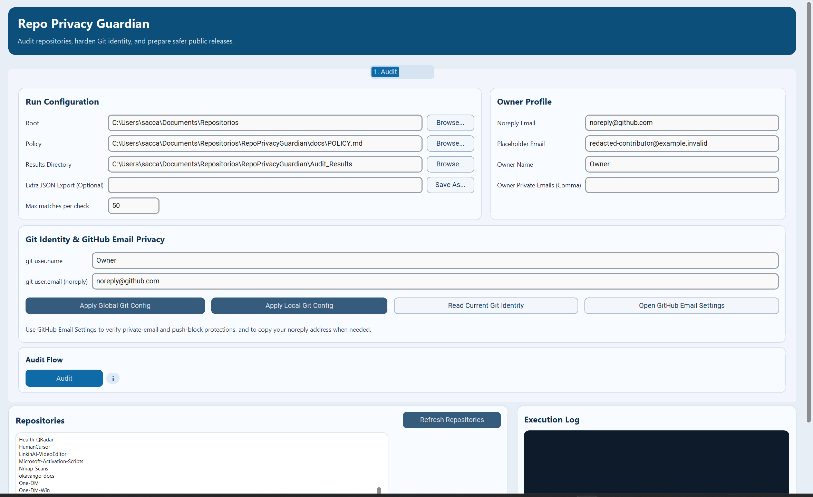
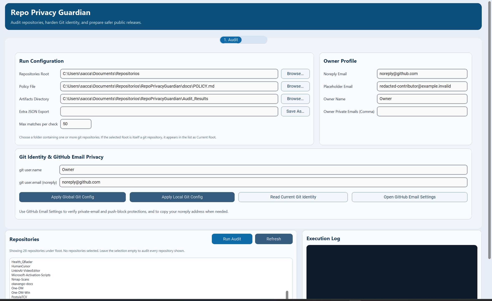
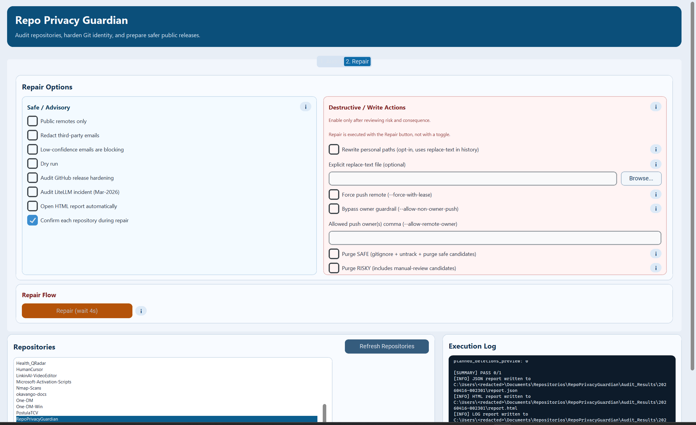
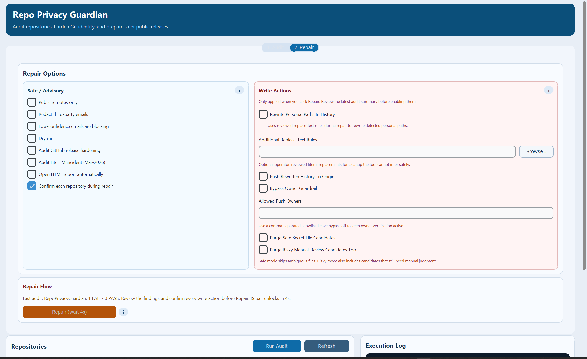

# UX/UI Audit

Audit date: 2026-04-16

## Scope

Screens audited in the running GUI:

- Audit view on desktop with default state
- Audit view on desktop with the current repository selected
- Repair tab while the staged repair gate is still locked
- Audit view after running an audit and waiting for the repair gate summary
- Compact desktop width around the minimum supported GUI size

## Method

- Launched the real `customtkinter` GUI locally from `main`
- Walked the main Audit and Repair flows in the running app
- Captured before screenshots from the rendered interface
- Applied UX, layout, and copy fixes in the shipped GUI
- Re-ran the GUI and captured after screenshots from the same states

## Main Findings

1. The default launch state could look broken.
   When the selected root was itself the target repository, the list stayed empty because only child repositories were shown. The app opened in a state that looked like missing data instead of a valid starting point.

2. The main action was too far from the decision point.
   `Audit` lived outside the repositories section, so the core flow of pick repo then run audit was visually fragmented and harder to scan.

3. Repository feedback was too weak.
   The screen did not clearly explain whether the root was valid, whether anything was selected, or why the repo list was empty.

4. Repair gating was technically correct but visually under-explained.
   After an audit, the repair state relied too much on logs and internal wording. Users had little high-signal summary about what passed, what failed, and when write actions would unlock.

5. The write-actions area felt heavier than necessary.
   Several labels were long, repetitive, and oriented around CLI flags instead of human intent. The section looked noisier than its actual function.

## Corrections Applied

- Included the current root repository in the GUI list whenever the selected root is itself a git repository.
- Auto-selected the only available repository when the list contains exactly one valid target.
- Added repository summary feedback so the screen explains current selection and whether the current root is part of the target set.
- Added an explicit empty state message for invalid or empty roots instead of leaving the list visually blank.
- Moved the main `Run Audit` action into the repositories header so repo choice and execution are grouped in the same visual area.
- Tightened the top spacing so the repositories block becomes discoverable earlier on desktop.
- Added a visible repair status summary that reports the latest audit outcome, pass/fail counts, and unlock timing during the staged cooldown.
- Simplified copy in the write-actions card and replaced repeated warning badges with shorter contextual helper text.
- Renamed several GUI labels to be more product-facing and less CLI-flag-centric.

## Screenshots

### Audit View, Desktop Default State

Before:

After:

### Audit View, Current Root Selected

Before:

After:

### Repair Locked State

Before:

After:

### Post-Audit State With Repair Summary

Before:

After:

### Compact Desktop Layout

Before:

After:

## Validation

- `python tests/release_smoke_gui.py`
- `python tests/release_smoke_cli.py`
- `python -m pytest -q`
- Manual GUI walkthrough with fresh screenshots after the fixes

## Remaining Limits

- The GUI remains desktop-first; compact widths are improved but still denser than the primary desktop layout.
- There is still no automated visual regression suite. The screenshots in `docs/ux-audit/` remain the current audit artifact for UI review.
