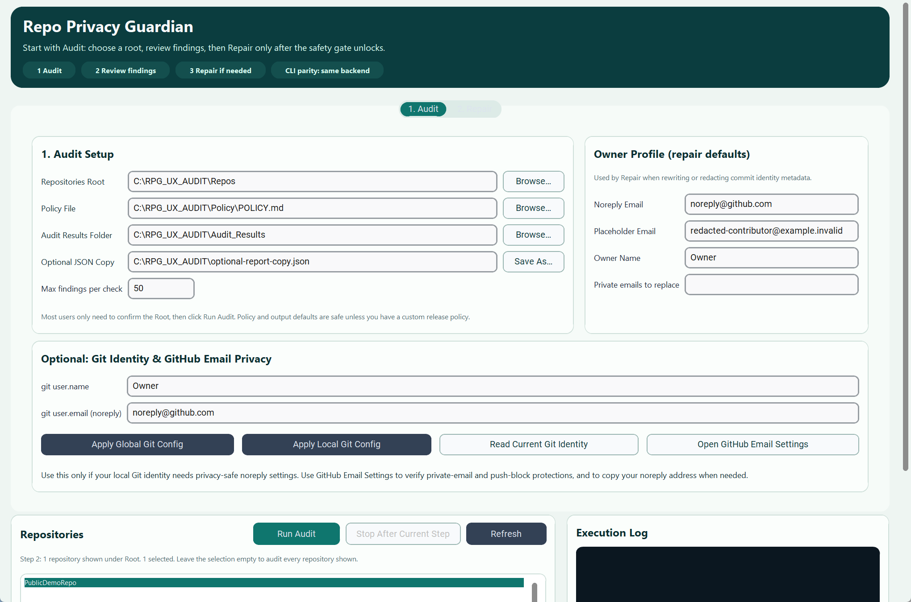
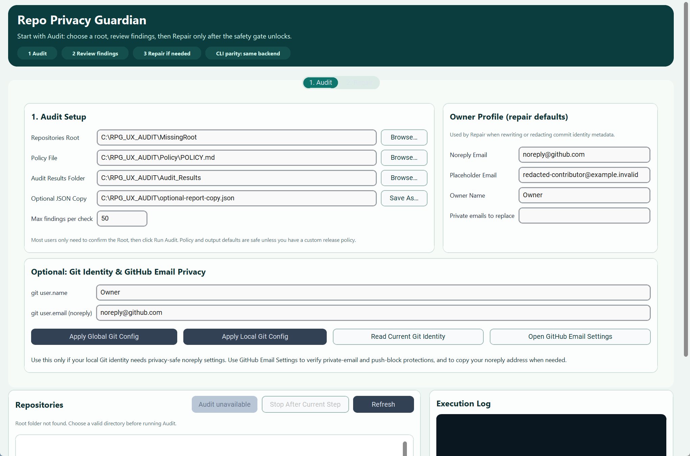
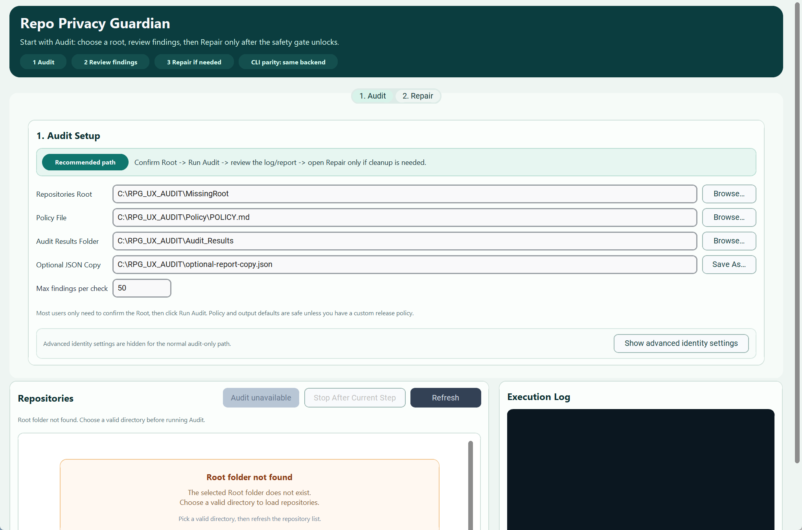
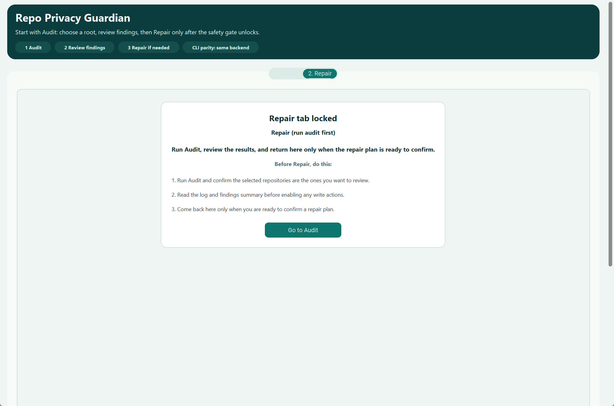
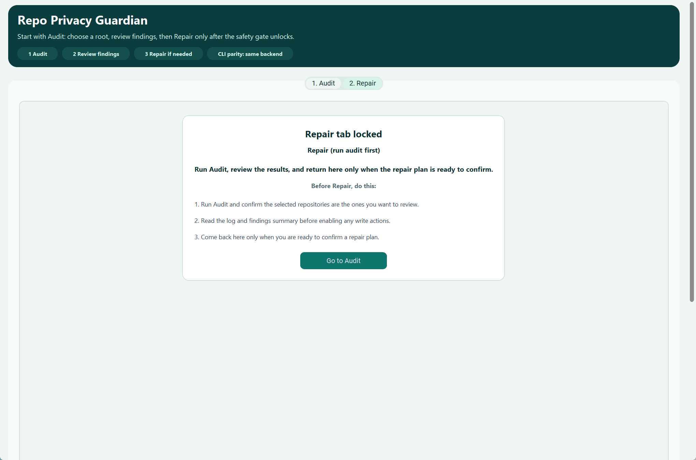
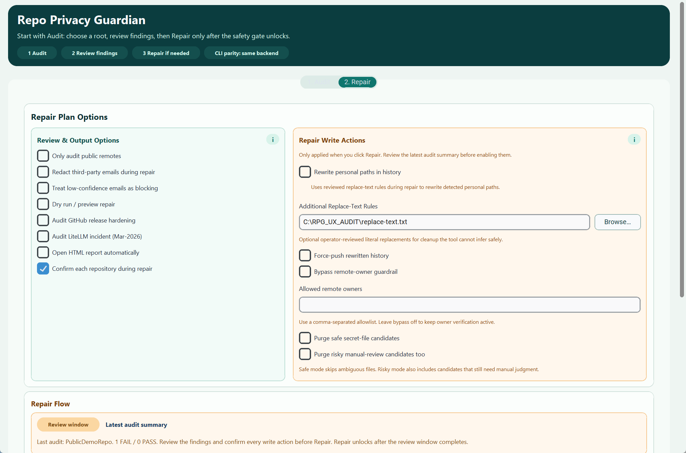
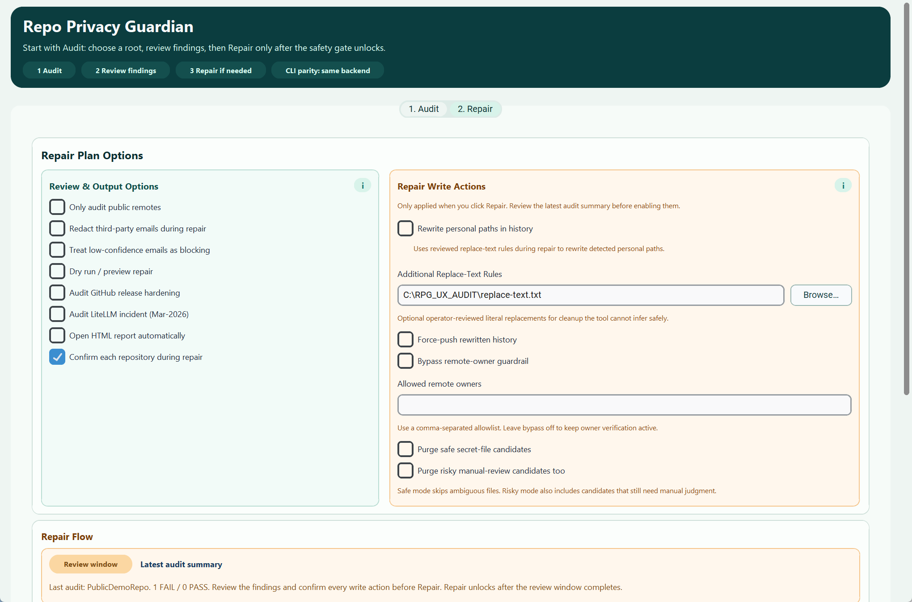
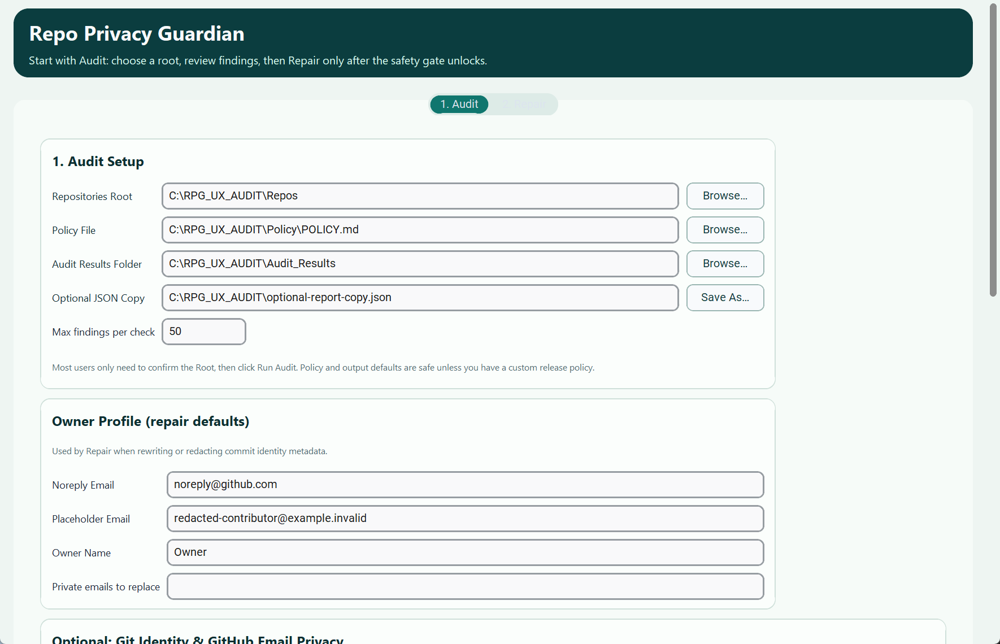
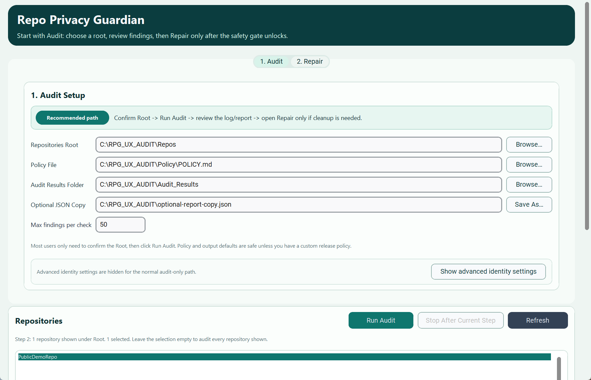

# UX/UI Audit

Audit date: 2026-04-24

## Scope

Screens audited in the running GUI:

- Audit view on desktop with the current repo as the only target
- Audit view with an invalid Root path
- Repair tab while the staged repair gate is still locked
- Repair tab immediately after an audit, during the review cooldown
- Compact desktop width near the minimum supported GUI size

## Method

- Launched the shipped `customtkinter` GUI locally from `main`
- Captured the real Tk window by HWND to avoid desktop/toast overlays in screenshots
- Neutralized visible screenshot paths to non-user placeholder paths before saving docs assets
- Walked the main `Audit -> review -> Repair` flow in the running app
- Applied corrective UX/UI copy, hierarchy, color, and responsive-layout changes in the GUI code
- Re-audited the first screen after the previous pass to reduce form overload for non-technical users
- Re-ran the app and captured after screenshots from the same states

## Main Findings

1. The GUI remained functionally aligned with the CLI and passed the automated contract tests, but the first screen still read more like a settings form than a workflow.
   A non-technical user could miss that the intended path is simply: confirm Root, run Audit, review, then Repair only if needed.

2. The owner profile and Git identity controls were correct, but showing them by default made the initial Audit screen feel heavier than the common user path requires.
   These controls are still necessary for repair/parity, but they should not compete with the primary `Run Audit` path on first launch.

3. Several labels were accurate for maintainers but still needed stronger visual grouping for public desktop users.
   Examples: `Artifacts Directory`, `Extra JSON Export`, `Max matches per check`, and repair options that did not clearly separate review toggles from write actions.

4. The blue-heavy release UI was readable but visually generic.
   Primary actions, neutral support actions, review options, and destructive repair actions benefited from a more modern teal/slate/amber palette with clearer state meaning.

5. The desktop header benefited from explicit workflow chips, but those chips consumed too much vertical space near the compact supported width.
   The compact layout needed responsive treatment so guidance does not push the operational cards too far down.

6. The tab selector for `Audit` and `Repair` had insufficient contrast in inactive states after the palette update.
   The labels were present but too easy to miss, especially on the locked Repair screen.

7. The tracked screenshot artifacts contained local machine paths in visible form fields in an earlier pass.
   This is not detected by the text-based self-audit because the data is embedded in PNG pixels, so the docs assets needed to be regenerated with neutral paths before public release.

## Corrections Applied

- Reframed the header around the staged workflow: Audit first, Repair only after the safety gate unlocks.
- Renamed the first setup card to `1. Audit Setup` and added simpler guidance for the default path.
- Added a `Recommended path` callout directly inside Audit setup so a new user sees the intended workflow before reading any configuration fields.
- Renamed technical fields to user-facing labels: `Audit Results Folder`, `Optional JSON Copy`, and `Max findings per check`.
- Clarified owner metadata as `Owner Profile (repair defaults)` and explained that it is used by Repair for identity rewrite/redaction.
- Marked Git identity controls as optional and clarified when a user should touch them.
- Collapsed advanced identity/profile controls by default while keeping every underlying GUI control and CLI-equivalent setting available through `Show advanced identity settings`.
- Renamed Repair groups to `Review & Output Options` and `Repair Write Actions` to reduce ambiguity.
- Tightened destructive-option labels while preserving the same underlying CLI-equivalent settings.
- Kept `Refresh` available when Root is invalid so users can correct the path and retry without restarting the GUI.
- Rendered unavailable audit actions in a neutral disabled state instead of primary-button blue.
- Updated the GUI palette from generic blue to a more deliberate teal/slate/amber system:
  primary audit actions use teal, support actions use slate, review panels use soft teal, and repair/write-risk panels use amber.
- Added a compact workflow strip in the desktop header: `1 Audit`, `2 Review findings`, `3 Repair if needed`, and `CLI parity: same backend`.
- Hid the workflow strip at compact width while preserving the concise header sentence, so the compact view keeps more vertical room for the main form.
- Changed the `Audit` / `Repair` tab selector to dark text on light segmented states so both tabs stay readable in active and inactive states.
- Regenerated all tracked UX screenshots with neutral visible paths and without external desktop overlays.

## Screenshots

### Audit View, Desktop Baseline

Before:

After:

### Audit View, Invalid Root State

Before:

After:

### Repair Locked State

Before:

After:

### Repair State After Audit

Before:

After:

### Compact Desktop Layout

Before:

After:

## Parity Notes

- No GUI-only execution path was added.
- No CLI flag was removed or changed.
- GUI controls still map into the same `build_guard_run_config()` fields used by CLI execution.
- Collapsing advanced identity controls changes only visibility; the variables and run-config mapping remain unchanged.
- Audit and Repair still run through the shared `execute_guard_pipeline()` backend.
- The staged GUI contract remains: `Audit` first, `Repair` locked until a valid audit context and review window exist.

## Validation

- `python -m ruff check .`
- `pyright -p pyrightconfig.json`
- `python -m pytest -q`
- `python tests/release_smoke_gui.py`
- `python tests/release_smoke_cli.py`
- Manual GUI walkthrough with fresh before/after screenshots from the live app

## Remaining Limits

- The GUI remains desktop-first and intentionally secondary to the CLI release contract.
- The compact layout is clearer, but naturally denser than the primary desktop width.
- The app still does not have automated visual regression coverage; `docs/ux-audit/` remains the maintained screenshot evidence for UI review.
