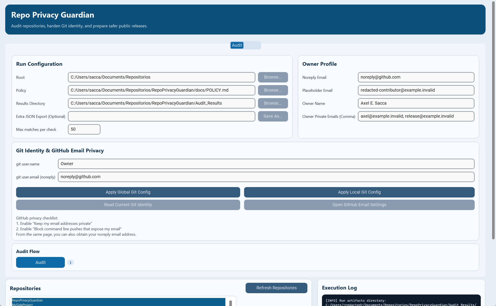
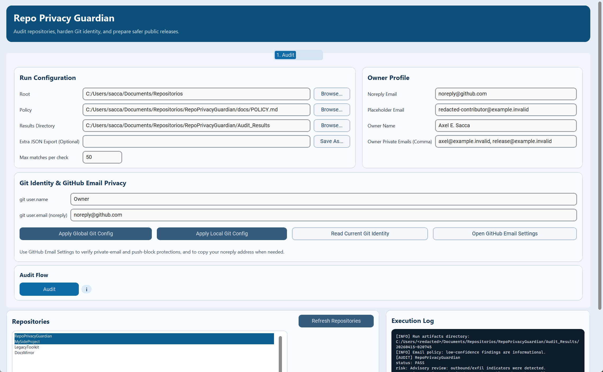

# UX/UI Audit

Audit date: 2026-04-15

Scope reviewed:

- Main Audit view on desktop
- Repair tab locked state on desktop
- Compact desktop layout around the minimum supported GUI width

Method:

- Launched the real `customtkinter` GUI locally from `main`
- Captured before screenshots from the rendered application
- Improved layout, interaction clarity, and visual affordance in the shipped GUI
- Captured after screenshots from the same states to validate the result

## Key Findings

1. Flow affordance was weak.
   The `Audit` / `Repair` tabs were visually tiny and easy to miss, so the staged workflow looked less intentional than the product behavior actually is.

2. Secondary actions looked disabled.
   Browse buttons, read-only actions, and repository utility actions used a muted fill that made active controls look unavailable.

3. The Git identity block spent too much vertical space.
   On wide desktop layouts the identity action buttons still wrapped into two rows, pushing the repository list and execution log further below the fold.

4. The locked `Repair` state felt unfinished.
   The tab mostly showed empty space with a short message and a small CTA, which made the flow feel harsher and less informative than intended.

5. The GUI default for opening the HTML report was too eager.
   Keeping report auto-open enabled by default created unnecessary surprise for users who only wanted to inspect the GUI workflow.

## Corrections Implemented

- Promoted the staged flow visually by relabeling the tabs to `1. Audit` and `2. Repair`.
- Restyled secondary buttons so they remain obviously interactive without competing with primary actions.
- Reflowed the Git identity action row to a single line on wide layouts and a wrapped layout only when needed.
- Reworked the locked `Repair` state into a centered instruction card with clearer next steps.
- Shortened the always-visible GitHub email privacy helper copy to reduce density while preserving the link-out action.
- Made `Open HTML report automatically` opt-in in the GUI instead of enabled by default.

## Screenshots

### Audit View, Desktop

Before:

After:

### Repair Locked State, Desktop

Before:

After:

### Audit View, Compact Desktop

Before:

After:

## Validation

- `python tests/release_smoke_gui.py`
- `python tests/release_smoke_cli.py`
- `python -m pytest -q`
- `python -m build`

## Remaining Limits

- The GUI remains a desktop-first companion to the CLI, not a fully separate product surface.
- There is still no full automated visual regression suite; the screenshots captured here are a manual audit artifact, not a pixel-diff test pipeline.
