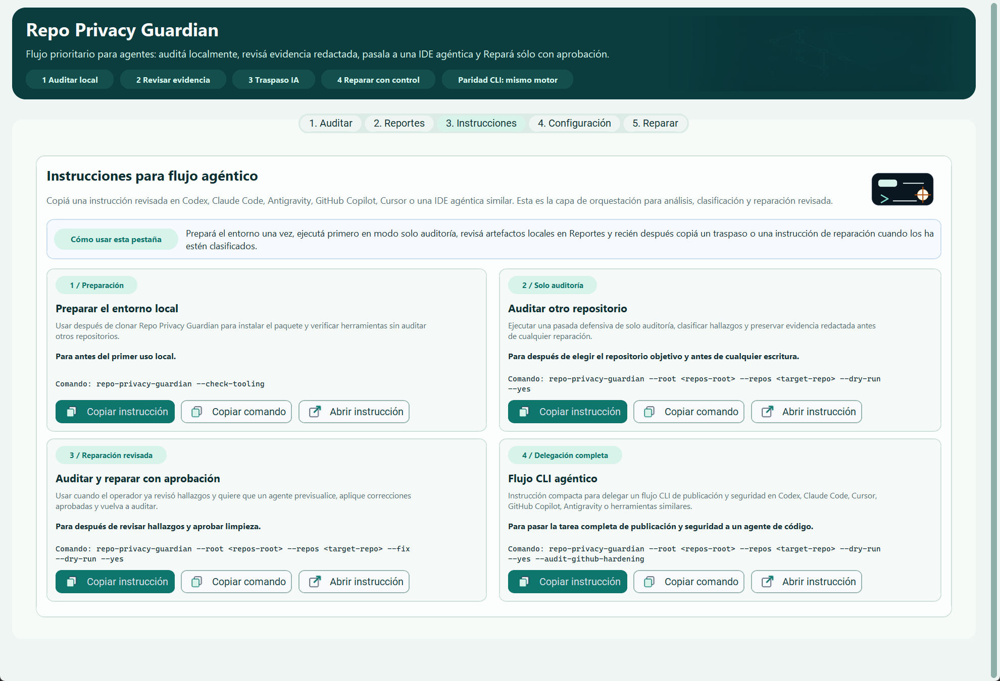

# UX/UI Audit

Audit date: 2026-04-24

## Scope

Screens audited in the running GUI:

- Audit view on desktop with the current repo as the only target
- Audit view with an invalid Root path
- Repair tab while the staged repair gate is still locked
- Repair tab immediately after an audit, during the review cooldown
- Compact desktop width near the minimum supported GUI size

## Method

- Launched the shipped `customtkinter` GUI locally from `main`
- Captured the real Tk window by HWND to avoid desktop/toast overlays in screenshots
- Neutralized visible screenshot paths to non-user placeholder paths before saving docs assets
- Walked the main `Audit -> review -> Repair` flow in the running app
- Applied corrective UX/UI copy, hierarchy, color, and responsive-layout changes in the GUI code
- Re-audited the first screen after the previous pass to reduce form overload for non-technical users
- Re-ran the app and captured after screenshots from the same states

## Main Findings

1. The GUI remained functionally aligned with the CLI and passed the automated contract tests, but the first screen still read more like a settings form than a workflow.
   A non-technical user could miss that the intended path is simply: confirm Root, run Audit, review, then Repair only if needed.

2. The owner profile and Git identity controls were correct, but showing them by default made the initial Audit screen feel heavier than the common user path requires.
   These controls are still necessary for repair/parity, but they should not compete with the primary `Run Audit` path on first launch.

3. Several labels were accurate for maintainers but still needed stronger visual grouping for public desktop users.
   Examples: `Artifacts Directory`, `Extra JSON Export`, `Max matches per check`, and repair options that did not clearly separate review toggles from write actions.

4. The blue-heavy release UI was readable but visually generic.
   Primary actions, neutral support actions, review options, and destructive repair actions benefited from a more modern teal/slate/amber palette with clearer state meaning.

5. The desktop header benefited from explicit workflow chips, but those chips consumed too much vertical space near the compact supported width.
   The compact layout needed responsive treatment so guidance does not push the operational cards too far down.

6. The tab selector for `Audit` and `Repair` had insufficient contrast in inactive states after the palette update.
   The labels were present but too easy to miss, especially on the locked Repair screen.

7. The tracked screenshot artifacts contained local machine paths in visible form fields in an earlier pass.
   This is not detected by the text-based self-audit because the data is embedded in PNG pixels, so the docs assets needed to be regenerated with neutral paths before publication.

## Corrections Applied

- Reframed the header around the staged workflow: Audit first, Repair only after the safety gate unlocks.
- Renamed the first setup card to `1. Audit Setup` and added simpler guidance for the default path.
- Added a `Recommended path` callout directly inside Audit setup so a new user sees the intended workflow before reading any configuration fields.
- Renamed technical fields to user-facing labels: `Audit Results Folder`, `Optional JSON Copy`, and `Max findings per check`.
- Clarified owner metadata as `Owner Profile (repair defaults)` and explained that it is used by Repair for identity rewrite/redaction.
- Marked Git identity controls as optional and clarified when a user should touch them.
- Collapsed advanced identity/profile controls by default while keeping every underlying GUI control and CLI-equivalent setting available through `Show advanced identity settings`.
- Renamed Repair groups to `Review & Output Options` and `Repair Write Actions` to reduce ambiguity.
- Tightened destructive-option labels while preserving the same underlying CLI-equivalent settings.
- Kept `Refresh` available when Root is invalid so users can correct the path and retry without restarting the GUI.
- Rendered unavailable audit actions in a neutral disabled state instead of primary-button blue.
- Updated the GUI palette from generic blue to a more deliberate teal/slate/amber system:
  primary audit actions use teal, support actions use slate, review panels use soft teal, and repair/write-risk panels use amber.
- Added a compact workflow strip in the desktop header: `1 Audit`, `2 Review findings`, `3 Repair if needed`, and `CLI parity: same backend`.
- Hid the workflow strip at compact width while preserving the concise header sentence, so the compact view keeps more vertical room for the main form.
- Changed the `Audit` / `Repair` tab selector to dark text on light segmented states so both tabs stay readable in active and inactive states.
- Regenerated all tracked UX screenshots with neutral visible paths and without external desktop overlays.

## Screenshots

### Audit View, Desktop Baseline

Before:

After:

### Audit View, Invalid Root State

Before:

After:

### Repair Locked State

Before:

After:

### Repair State After Audit

Before:

After:

### Reports Dashboard And Agent Handoff

After:

### Prompts Library

After:

### Compact Desktop Layout

Before:

After:

## Parity Notes

- No GUI-only execution path was added.
- No CLI flag was removed or changed.
- GUI controls still map into the same `build_guard_run_config()` fields used by CLI execution.
- Collapsing advanced identity controls changes only visibility; the variables and run-config mapping remain unchanged.
- Audit and Repair still run through the shared `execute_guard_pipeline()` backend.
- The staged GUI contract remains: `Audit` first, `Repair` locked until a valid audit context and review window exist.

## Validation

- `python -m ruff check .`
- `pyright -p pyrightconfig.json`
- `python -m pytest -q`
- `python tests/release_smoke_gui.py`
- `python tests/release_smoke_cli.py`
- Manual GUI walkthrough with fresh before/after screenshots from the live app

## Remaining Limits

- The GUI remains desktop-first and intentionally secondary to the CLI release contract.

## 2026-04-25 Follow-Up

The next UX pass reduces first-screen load further:

- Added root-level `DESIGN.md` tokens and rules so future GUI work has a durable visual/interaction contract.
- Kept the main Audit screen focused on Root, repository selection/drop target, Audit controls, and the log.
- Moved policy, report export, GitHub owner/org remote audit, clone tuning, and identity setup into a collapsible Settings area.
- Persisted only non-secret GUI setup preferences locally; tokens, private owner email lists, replacement files, and push bypass choices are not stored.
- Added drag-and-drop repository-folder targeting when the optional desktop DnD runtime is available, with Browse/Refresh still available as the fallback.
- The compact layout is clearer, but naturally denser than the primary desktop width.
- The app still does not have automated visual regression coverage; `docs/ux-audit/` remains the maintained screenshot evidence for UI review.

## 2026-04-26 Follow-Up

The UX follow-up pass focused on target-state clarity and safer review language:

- When GitHub owner/org remote audit is active, the repository list now switches to a dedicated remote audit state instead of showing stale local repositories or Root validation errors.
- The remote state explains that repositories are discovered through GitHub, cloned temporarily, cleaned up after the run, and remain audit-only with Repair locked.
- The hidden Settings hint now calls out that remote mode ignores the local repository list.
- The Repair summary and confirmation prompt now separate blocking failure categories, manual-review advisory signals, and fixture/documentation matches kept non-blocking.
- Regression tests cover the remote target-state surface and the richer Repair review summary.

## 2026-04-26 Contextual-Help Pass

The next GUI pass focused on reducing uncertainty without reopening the first-screen overload:

- Added hover help for non-obvious controls in the main target picker, Settings, GitHub owner/org remote audit, identity setup, Repair options, and run controls.
- Added visible `i` badges next to advanced Settings and Repair options where hover affordance alone would be too easy to miss.
- Kept the primary Audit path unchanged: repository selection, Audit, Stop, Refresh, and log remain the visible first-screen workflow.
- Centralized tooltip copy in code and added regression coverage so future UI options must keep explanatory text.

## 2026-04-30 Runtime Visual-Asset Pass

The current GUI now uses a small packaged raster asset set instead of relying only on solid CustomTkinter surfaces:

- Added a window icon and subtle header watermark that preserve the operational, local-first tone.
- Added small state visuals for repository targeting, Reports evidence, Prompts workflows, and the gated Repair screen.
- Added DPI-aware local icon assets to the most common actions: Audit, Stop, Refresh, Reports, Prompts, Settings, and Repair.
- Kept all text in Tk labels/buttons instead of embedding text in images, so English/Spanish locale parity remains intact.
- Kept assets local and bounded under `repo_privacy_guardian_assets/`; the GUI falls back to the existing solid-color layout if an asset cannot be loaded.

## 2026-04-30 GUI Theme Pass

The theme pass added a presentation-only Light/Dark startup selector without widening the CLI contract:

- Replaced visible light-only surfaces with a shared GUI palette so Audit, Reports, Prompts, Settings, Repair, lists, logs, badges, and gated states render coherently in both startup modes.
- Persisted only the non-secret `gui_appearance` GUI preference alongside locale and setup state.
- Kept theme labels locale-aware while preserving the same CLI flags, policy keys, report fields, and `GuardRunConfig` mappings.
- Added dark-mode button icon tinting in memory so local packaged assets remain readable without introducing separate tracked icon copies.
- Added dark-mode pictogram background blending in memory so the existing Reports, Prompts, Repair, and repository-state visuals feel integrated with dark panels without generating or tracking duplicate assets.
- Tuned global and repository-list scrollbars with semantic low-contrast tokens, and compacted the locked Repair gate so its guidance remains visible in the first viewport.
- Added a localized empty-state overlay to the Execution Log so the first Audit screen no longer presents a large unexplained blank panel before any run starts.
- Added a localized `Go to Audit` action to the Reports empty state so first-time users are not left on a dead-end panel before any run artifacts exist.
- Added a localized Reports action that copies a privacy-safe agent handoff prompt using repository-relative artifact paths when available, so GUI users can move from visual evidence to agentic review without pasting raw findings.
- Updated Reports artifact labels to prefer repository-relative paths when available, reducing long path noise and avoiding visible personal absolute paths in normal repo-local runs.
- Added regression coverage for theme helper normalization, settings persistence, tooltip copy, smoke startup, and locale/theme independence from run-config parity.
- Manually QAed fresh live-window screenshots in both Light and Dark modes before release validation.

## 2026-04-26 GUI Locale Pass

The localization pass added a presentation-only language selector without widening the CLI contract:

- Added English and Spanish (Latin America) locale catalogs for GUI labels, dialogs, safety copy, and contextual help.
- Persisted the locale as non-secret GUI setup state while keeping tokens, identity secrets, and repair bypass controls out of saved settings.
- Kept CLI parity by mapping localized labels back to the same internal variables and `GuardRunConfig` fields; tests assert locale changes do not alter run-config payloads.
- Left CLI help, report field names, JSON/HTML schema, policy keys, and backend log semantics unchanged.

## 2026-05-01 Spanish Locale QA Pass

This pass audited the Spanish (Latin America) GUI catalog after the agent-first redesign:

- Replaced avoidable English UI copy such as `Prompts`, `audit-only`, `handoff`, `owner`, `settings`, `workers`, `drag-and-drop`, and `manual-review` with Spanish presentation text.
- Kept technical/product tokens where they are contract or platform names: CLI, GUI, GitHub, Git, PASS/FAIL, SAFE/RISKY category tags, `report.json`, `report.html`, `run.log`, and CLI flags.
- Added regression coverage that fails when common untranslated UX fragments reappear in the Spanish GUI labels or tooltips.
- Preserved locale as presentation-only; no CLI flags, policy keys, report schema, or `GuardRunConfig` mappings changed.

## 2026-04-26 GUI Companion Reconstruction

The next GUI pass re-centered the desktop app around the primary agentic CLI use case:

- Rebuilt the information architecture as `Audit`, `Reports`, `Prompts`, `Settings`, and gated `Repair`.
- Kept the first Audit path focused on local target selection, drag-and-drop, run/stop/refresh, and execution log.
- Added a Reports dashboard for the latest local `report.json`, `report.html`, `run.log`, and `run_state.json` paths, with quick-open actions but no raw sensitive evidence rendering.
- Added a Prompts tab backed by a tracked bilingual prompt registry for environment setup, audit-only, reviewed audit-and-repair, and compact CLI delegation workflows.
- Moved policy/output/GitHub/identity parity controls into Settings and kept advanced Repair write options collapsed by default.
- Preserved the shared backend and `GuardRunConfig` mapping; the change is presentation and workflow organization, not a new execution engine.

## 2026-05-01 Agent-First Visual QA Pass

This pass checked whether the desktop companion still matched the repo's real usage model after the public release: CLI automation first, human evidence review, then coding-agent orchestration and gated repair.

Findings:

- The Audit screen was clean but still underplayed the mandatory agentic workflow. A new user could run an audit, then miss that `Reports` and `Prompts` are the intended bridge into Codex, Claude Code, Antigravity, GitHub Copilot, Cursor, or similar IDEs.
- The execution log empty state existed in code but could render underneath the `CTkTextbox`, making the right-hand panel look blank in the first-run screenshot.
- High-DPI Windows windows need responsive decisions based on logical UI width, not raw physical pixels. Without that normalization, compact screenshots could keep desktop-only header chips visible and clip guidance.
- Light and dark themes both worked without new raster assets. The current asset set already supports the needed state visuals; this pass needed hierarchy and responsive fixes, not additional generated imagery.

Corrections applied:

- Rewrote the GUI header around the explicit `Audit locally -> Review evidence -> Agent handoff -> Gated Repair` path.
- Added a direct `Agent prompts` shortcut from Audit to the Prompts tab so the agent-first workflow is discoverable without making the first screen heavier.
- Added a short guide at the top of the Prompts tab and numbered prompt cards so the operator sees environment prep, audit-only, reviewed repair, and compact CLI delegation as one staged flow.
- Made Prompt cards responsive: two columns on wide desktop, one column near the compact minimum width, with the workflow guide stacked and the decorative visual hidden to preserve text width.
- Moved the execution-log empty label into the textbox overlay layer so it is visible until real output is written.
- Fixed logical window-width detection to normalize Tk physical geometry once through the CustomTkinter scaling factor, preserving desktop layout on wide windows and compact layout near the minimum width.
- Refreshed the tracked light-mode screenshots with neutral paths and kept a local dark-mode QA capture under ignored workspace metadata.

Validation notes:

- Presentation changed only labels, layout, and helper actions. No CLI flags, report fields, policy keys, or `GuardRunConfig` mappings changed.
- The same backend still owns Audit, Reports, GitHub hardening, remote audit, and Repair behavior.
- The GUI still keeps Repair locked until a valid audit context exists.

## 2026-05-01 Desktop Design-Method Pass

This pass reviewed whether modern frontend-design guidance should change the GUI process. The useful parts are now documented as desktop-adapted rules in `DESIGN.md`; the web-specific parts remain intentionally out of scope.

Adopted:

- design tokens before widget changes
- complete-state review instead of isolated control tweaks
- screenshot QA for real desktop states, including light/dark and compact layouts when UI changes touch those surfaces
- code-native, locale-driven text rather than text embedded in raster assets
- agent-first hierarchy: local audit, redacted evidence, agent handoff, then gated repair

Rejected:

- browser-only QA as the GUI acceptance gate
- React/Vite or web-app migration as a default path
- landing-page hero patterns, marketing sections, or decorative full-window backgrounds
- any runtime visual dependency that would require network access or telemetry

Functional correction from the same audit:

- Report-directory enforcement now preserves symlinked results paths long enough for artifact creation to fail closed instead of resolving and writing through the symlink destination.
- CLI now reports artifact-creation failures as a controlled runtime error before entering the audit pipeline.

Validation notes:

- The desktop GUI remains the optional companion to the CLI backend.
- The design method changes documentation and maintenance criteria only; it does not add GUI-only behavior.
- New report-directory hardening is covered by regression tests for symlinked requested/default results paths and CLI pre-pipeline failure handling.

## 2026-05-04 Desktop UX Follow-Up

This pass applied the desktop-adapted frontend-design criteria without changing the implementation target from `customtkinter`.

Findings:

- The Reports tab correctly offered `Go to Audit` before any run artifacts existed, but it still showed disabled artifact buttons in the same action row. That made the empty state feel busier than the one useful next step.
- The Reports action row worked at the primary desktop width, but localized button labels needed an explicit compact reflow rule so artifact actions do not compete with each other near the minimum supported width.

Corrections applied:

- Hid downstream Reports artifact buttons until a run exists, keeping the first-run empty state focused on `Go to Audit`.
- Kept artifact buttons disabled while hidden, then restored them as visible normal actions after artifacts are remembered.
- Reflowed the Reports agent-handoff and artifact buttons onto a second row in compact desktop layout.
- Documented the empty-state rule in `DESIGN.md` so future GUI states avoid disabled-action clutter.

Validation notes:

- Presentation changed only Reports-tab layout and empty-state affordances.
- No CLI flags, report fields, policy keys, remediation defaults, or `GuardRunConfig` mappings changed.

## 2026-05-04 Deep Agent-First GUI Review

This pass revisited whether the GUI/UX makes sense for a tool whose highest-value path is CLI evidence plus AI-assisted classification and repair planning.

Findings:

- Reports still behaved like an artifact directory. It showed status and paths, but did not clearly tell the operator or coding agent what to do next after PASS, FAIL, review-only signals, or runtime errors.
- The copied agent handoff referenced artifact paths, but did not include enough safe run context for an agent to start with the right policy posture without first inferring state from multiple files.
- The Prompts tab had the right library, but the cards were flat. Users had to infer which prompt was setup, audit-only, reviewed repair, or full delegation.
- The existing packaged raster assets remained sufficient. This pass needed workflow hierarchy and state copy, not new bitmap assets.

Corrections applied:

- Added a Reports decision panel with a localized next action for first-run, missing report payload, blocking failure, advisory/manual-review, clean PASS, and runtime/aborted states.
- Added a three-step handoff checklist in Reports once artifacts exist: open redacted evidence, copy the handoff, then use a reviewed prompt.
- Added a Reports shortcut into the Prompts tab after artifacts exist, keeping the first-run empty state focused on `Go to Audit`.
- Expanded the copied agent handoff with safe summary context: run status, repository count, blocking-category count, manual-review signal count, fixture/documentation context count, recommended next action, and repository-relative artifact paths.
- Reworked Prompt cards with stage badges and "best for" guidance so the library reads as a workflow instead of a list.
- Polished Spanish prompt-registry copy to avoid avoidable English UX fragments in the visible GUI.

Validation notes:

- The changes remain presentation and orchestration only: no CLI flags, report fields, policy keys, remediation defaults, or `GuardRunConfig` mappings changed.
- Reports still render paths and counts only. Raw findings remain in local artifacts, not in GUI handoff copy.
- Screenshots were captured before and after for Reports and Prompts in the running desktop app.
- Functional validation covered `ruff`, `pyright`, full `pytest`, GUI/CLI smoke tests, and the release-contract check.

## 2026-05-04 Continuous Visual QA Pass

This pass continued from the merged `main` GUI and inspected fresh desktop screenshots of Audit, Reports, Prompts, and Repair states.

Findings:

- The invalid Root empty state showed the right diagnosis, but the correction action was separated from the error card. Users had to look back up to the Root field or Refresh button instead of acting where the state explained the problem.
- The Reports handoff checklist used filled label blocks that could be mistaken for disabled buttons.
- The Reports title still sounded like a generic dashboard instead of a latest-run review surface.

Corrections applied:

- Added a direct `Choose Root` / `Elegir carpeta` action inside the repository empty state for invalid or empty local roots.
- Made Root-folder browse actions refresh the repository list immediately after selection, keeping the Audit screen state in sync without requiring a separate Refresh click.
- Changed the Reports heading to latest-run review copy and made the checklist read as numbered guidance rather than controls.
- Stacked Reports handoff steps in compact desktop layouts and widened one-column Prompt card text wraps so compact cards do not look half-empty.
- Re-captured Audit and Reports screenshots after the visual changes; tracked Reports/Prompts screenshots remain sanitized under `docs/ux-audit/after/`.

Validation notes:

- These changes are GUI presentation/state-flow only. CLI flags, report fields, policy keys, remediation defaults, and `GuardRunConfig` mappings are unchanged.
